# 📍 KinAI-GeoPulse - Privacy-First Family Location Tracking and Geofencing System

[](https://github.com/Logulokesh/KinAI-GeoPulse)
[](https://hub.docker.com/r/kinai/geopulse)
[](LICENSE)
[](docs/privacy.md)
<p align="center">
  
</p>

> **A privacy-first family location tracking and geofencing system integrated with the KinAI Ecosystem, leveraging Traccar for secure, real-time location data and contextual insights.**

---
<!-- Row 1: Identify the Challenge -->
<table style="width: 100%; border-collapse: collapse; font-family: sans-serif;">
  <tr>
    <td style="width: 200px; text-align: center; vertical-align: top; padding: 40px;">
      
    </td>
    <td style="padding: 40px; vertical-align: top;">
      <h2 style="color: #dc2626; display: flex; align-items: center; gap: 10px; margin-top: 0;">
        <span style="font-size: 24px;">🔍</span> 1. Identify the Challenge
      </h2>
      <p>
        Most family location apps depend on Big Tech, are invasive, and show raw data without context.
      </p>
      <ul>
        <li>❌ No meaningful alerts</li>
        <li>❌ Privacy risks</li>
        <li>❌ No zone or routine awareness</li>
        <li>❌ No AI integration</li>
      </ul>
    </td>
  </tr>
</table>
<table width="100%" border="0">
  <tr>
    <td width="15%" valign="top">
      
    </td>
    <td width="70%" valign="top">
    
<details>
  <summary>🤝 Think Like a Human Agent </summary>

<em> “I just want to know where my kids are when they’re out — nothing fancy, just peace of mind. 🧒👧 Sure, I could use a maps API to check their distance from home, 🗺️ but that feels like leaving the front door wide open 🚪 and handing the keys to a stranger. 🔑 Giving that much personal location data to Big Tech means risking privacy and control. 🔐 Our project isn’t about just tracking — it’s about protecting family privacy first, 🛡️ while still knowing what truly matters.” </em>
</details>

  </tr>
</table>
<!-- Row 2: Engineer the Approach -->
<table style="width: 100%; border-collapse: collapse; font-family: sans-serif; background-color: #f9f9f9;">
  <tr>
    <td style="padding: 40px; vertical-align: top;">
      <h2 style="color: #16a34a; display: flex; align-items: center; gap: 10px; margin-top: 0;">
        <span style="font-size: 24px;">⚙️</span> 2. Engineer the Approach
      </h2>
      <p>
        KinAI-GeoPulse is a local-first, privacy-focused system using Traccar, FastAPI, and PostgreSQL to add context to location data.
      </p>
      <ul>
        <li>🛰️ Traccar device tracking</li>
        <li>🧠 FastAPI for smart insights</li>
        <li>📦 Secure local storage</li>
        <li>🔐 Cloud-free config</li>
        <li>🤖 LLM-ready outputs</li>
      </ul>
    </td>
    <td style="width: 200px; text-align: center; vertical-align: top; padding: 40px;">
      
    </td>
  </tr>
</table>

<!-- Row 3: Implement the Outcome -->
<table style="width: 100%; border-collapse: collapse; font-family: sans-serif;">
  <tr>
    <td style="width: 200px; text-align: center; vertical-align: top; padding: 40px;">
      
    </td>
    <td style="padding: 40px; vertical-align: top;">
      <h2 style="color: #dc2626; display: flex; align-items: center; gap: 10px; margin-top: 0;">
        <span style="font-size: 24px;">✅</span> 3. Implement the Outcome
      </h2>
      <p>
        KinAI-GeoPulse turns location data into clear, actionable alerts and summaries, enhancing family safety and privacy.
      </p>
      <ul>
        <li>🔔 Real-time geofence alerts</li>
        <li>🏡 Context-aware summaries</li>
        <li>📲 Private updates via chat</li>
        <li>🧩 Integrates with KinAI modules</li>
      </ul>
    </td>
  </tr>
</table>

---
## 🎯 Overview

KinAI-GeoPulse is a privacy-focused location tracking and geofencing microservice designed to provide real-time family location data, distance-from-home calculations, and geofence-based alerts. Built with FastAPI and integrated with Traccar, it ensures secure, local processing of location data while seamlessly contributing to the KinAI Ecosystem's natural language chat capabilities.

This project enables families to stay connected with actionable insights, such as knowing when a family member arrives home or leaves a designated area, all while prioritizing data sovereignty and privacy.

---

## 🌟 Key Features

- 📍 **Real-Time Location Tracking**: Monitors family members' locations via Traccar-connected devices.
- 🏠 **Distance-from-Home Calculation**: Computes distances between current locations and a predefined home coordinate using the Haversine formula.
- 🔔 **Geofencing Alerts**: Tracks entries and exits from predefined zones for safety and awareness.
- 🔋 **Device Status Monitoring**: Provides device details like battery levels and last update times.
- 🔒 **Privacy-First Design**: Local processing with secure API authentication and no cloud dependency.
- 🔗 **KinAI Ecosystem Integration**: Feeds location and geofencing data into the natural language chat hub for contextual responses.

---

## 💬 Contribution to KinAI Ecosystem

KinAI-GeoPulse plays a critical role in the KinAI Ecosystem by providing **location-based contextual data** to the natural language chat hub. This data enhances the AI's ability to deliver meaningful, family-centric responses, integrating seamlessly with other KinAI projects like KinAI-Vision, KinAI-CareVault, KinAI-NexPatrol, KinAI-ScholarKit, and KinAI-Mentor.

### 📊 Data Provided to the KinAI Ecosystem

| Data Type | Description | Example Use in Chat |
|-----------|-------------|---------------------|
| **Current Location** | Latitude, longitude, and address of family members' devices | **Q:** "Where is Emma?" **A:** "Emma is at school, located at 123 Main St, 5 km from home." |
| **Distance from Home** | Distance (in km) from a predefined home coordinate | **Q:** "Is anyone near home?" **A:** "Logu is 0.5 km from home, likely arriving soon." |
| **Geofence Events** | Entry/exit events for predefined zones (e.g., home, school) | **Q:** "Did Sarah leave school?" **A:** "Sarah left the school geofence at 3:15 PM." |
| **Device Status** | Battery level, last update time, and device activity status | **Q:** "Is dad's phone okay?" **A:** "Dad's phone is active with 80% battery, last updated 5 minutes ago." |
| **Daily Summary** | Summary of a device's movements and activities for the day | **Q:** "What did Logu do today?" **A:** "Logu traveled 12 km, visited the office, and spent 4 hours at home." |
| **Recent Events** | Recent location-related events (e.g., speeding, zone entry) | **Q:** "Any updates on Emma?" **A:** "Emma entered the park geofence at 4:30 PM." |

### 🔄 Integration Benefits

- **Contextual Awareness**: Combines location data with KinAI-Vision (home activity) and KinAI-CareVault (health status) for responses like, "Emma is at school and her vitals are normal."
- **Family Safety**: Enhances KinAI-NexPatrol's security alerts with location context, e.g., "An unrecognized visitor is at the door, and Sarah is 10 km away."
- **Activity Correlation**: Links location with KinAI-ScholarKit's educational progress, e.g., "Emma completed her homework at the library."
- **Real-Time Insights**: Powers the natural language chat hub to provide timely, actionable answers, strengthening family connectivity.

---

## 🏗️ System Architecture

```mermaid
graph TD
    subgraph "📍 KinAI-GeoPulse"
        API[🚀 FastAPI Service<br/>Location Endpoints]
        TRACCAR[🗺️ Traccar Server<br/>GPS Tracking]
        DB[🗄️ PostgreSQL<br/>Location Data]
    end

    subgraph "🔗 KinAI Ecosystem"
        CHAT[🤖 Natural Language Chat Hub]
        VISION[🏠 KinAI-Vision<br/>Activity Detection]
        CAREVAULT[🏥 KinAI-CareVault<br/>Health Monitoring]
        NEXPATROL[🛡️ KinAI-NexPatrol<br/>Security Alerts]
        EDUCATION[🎓 KinAI-ScholarKit & Mentor<br/>Learning Insights]
    end

    API -->|Location Data| CHAT
    TRACCAR -->|GPS Data| API
    DB -->|Storage| TRACCAR
    CHAT -->|Contextual Queries| VISION
    CHAT -->|Health Context| CAREVAULT
    CHAT -->|Security Context| NEXPATROL
    CHAT -->|Education Context| EDUCATION

    style API fill:#e1f5fe,stroke:#0277bd
    style TRACCAR fill:#e8f5e8,stroke:#388e3c
    style DB fill:#fff3e0,stroke:#f57c00
    style CHAT fill:#fce4ec,stroke:#c2185b
```



---

## 🔧 Tech Stack

- **Backend**: FastAPI, Python 3.11
- **Location Service**: Traccar (open-source GPS tracking platform)
- **Database**: PostgreSQL (via Traccar)
- **Environment Management**: python-dotenv
- **Containerization**: Docker, Docker Compose
- **Dependencies**: requests, pydantic, uvicorn

---

## 🚀 Getting Started

### 📋 Prerequisites

- ✅ Docker & Docker Compose
- ✅ Python 3.11 (for local development)
- ✅ Traccar server access (configured in `.env`)
- ✅ Sufficient storage for PostgreSQL data

### ⚡ Quick Setup

```bash
# 1️⃣ Clone the repository
git clone https://github.com/Logulokesh/KinAI-GeoPulse.git
cd KinAI-GeoPulse

# 2️⃣ Configure environment
cp .env.example .env
# Edit .env with your Traccar URL, credentials, and home coordinates

# 3️⃣ Deploy with Docker
docker-compose up -d

# 4️⃣ Test the API
curl http://localhost:8000/family/devices
```

### 📂 Project Structure

```
KinAI-GeoPulse/
├── .env              # Environment variables (Traccar config, home coordinates)
├── Dockerfile        # Docker configuration for FastAPI service
├── docker-compose.yml # Orchestrates Traccar, PostgreSQL, and API
├── main.py           # FastAPI application with location endpoints
├── requirements.txt  # Python dependencies
└── README.md         # Project documentation
```

---

## 📚 API Endpoints

| Endpoint | Description | Response |
|----------|-------------|----------|
| `GET /` | API info | API version and message |
| `GET /family` | List all users | List of user details |
| `GET /family/devices` | List all devices | Device details (ID, name, status, battery) |
| `GET /family/{device_id}/location` | Get latest location | Latitude, longitude, address, speed, timestamp |
| `GET /family/{device_id}/distance-from-home` | Distance from home | Distance (km), home/current coordinates |
| `GET /family/{device_id}/daily-summary` | Daily activity summary | Movement and activity report |
| `GET /zones` | List geofences | Geofence details (ID, area, name) |
| `GET /events` | Recent events (last hour) | Location-related events |
| `GET /health` | Health check | API and Traccar connection status |

---

## 🔐 Privacy & Security

- 🏠 **Local Processing**: All data processing occurs on your local network.
- 🔒 **Secure Authentication**: Uses HTTP Basic Auth for Traccar API access.
- 🔐 **Encrypted Storage**: PostgreSQL stores data securely with Traccar.
- 🔍 **Transparent Operations**: Open-source code for full visibility.
- 💬 **Secure Integration**: Location data is securely shared with the KinAI chat hub.

---

## 🔗 Integration with KinAI Ecosystem

KinAI-GeoPulse integrates with the KinAI Ecosystem via the natural language chat hub, providing location data that enhances contextual responses. Examples include:

- **With KinAI-Vision**: "Emma is home and watching TV in the living room."
- **With KinAI-CareVault**: "Dad is at the pharmacy, likely picking up his medication."
- **With KinAI-NexPatrol**: "A visitor is at the door, and Sarah is 5 km away."
- **With KinAI-ScholarKit**: "Emma is at the library and has completed her homework."

This synergy creates a unified, privacy-first family assistant that delivers real-time, actionable insights.

---

## 🚧 Future Enhancements

- 📍 **Advanced Geofencing**: Dynamic geofence creation via the chat interface.
- 🔔 **Custom Alerts**: User-defined notifications for specific locations or events.
- 📊 **Historical Analysis**: Long-term location trends for family routines.
- 🔗 **Deeper Integration**: Enhanced data fusion with KinAI-CareVault biometrics and KinAI-NexPatrol security alerts.

---

## 📄 License

[MIT License](https://opensource.org/licenses/MIT) - See [LICENSE](LICENSE) for details.

## 🙏 Acknowledgments

Built with passion for privacy, intelligence, and family connectivity, KinAI-GeoPulse is part of the KinAI Ecosystem, dedicated to advancing privacy-first AI solutions.
